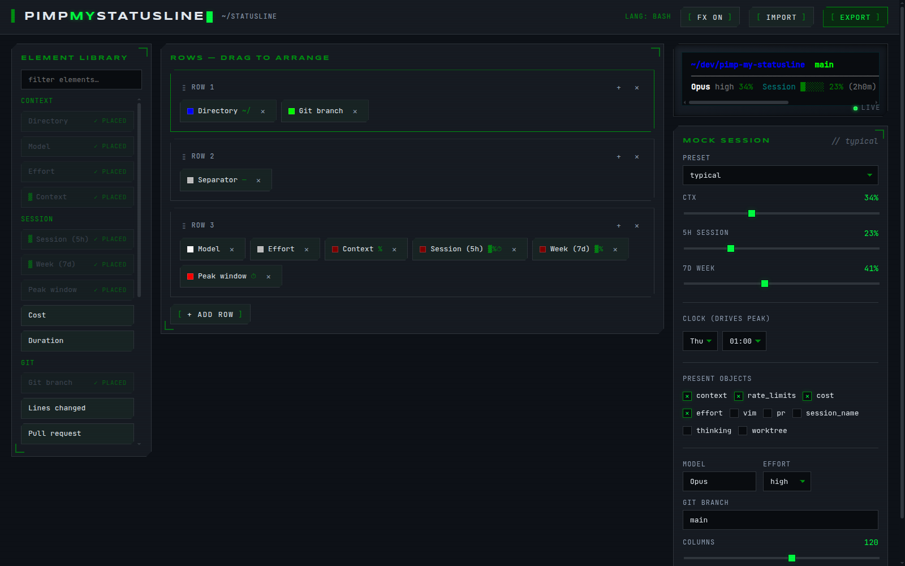

# Pimp My Statusline

**A visual workbench for the bottom line of your terminal.**

Build your [Claude Code statusline](https://pimpmystatusline.dev): drag elements into place, pick colors from the xterm-256 palette, adopt a reactive ASCII pet. Export a clean, readable script you can install in seconds and keep hacking by hand.



## Features

- **Live terminal preview**: wrapped in the window chrome of your OS, it renders the exact bytes your terminal will print, fed by a scrubbable mock session (drag the context % slider, watch the bars and the pet react)
- **Element library**: directory, git branch, model, effort, context window, 5h/7d rate limits with gauge bars + reset countdowns, cost, duration, lines ±, output style, agent, version, and more
- **Multi-row layout**: arrange elements across as many rows as you like, with drag & drop (keyboard accessible)
- **Per-element styling**: fixed xterm-256 colors, basic ANSI-16 colors, or threshold mode (green → yellow → red as a percentage climbs, with editable breakpoints)
- **Display variants**: gauge bar, percentage and countdown timer per metric, with configurable bar width
- **Reactive ASCII pets**: a cactus, cat, dog, owl, robot or fish flanks your statusline and changes mood as your context fills up. Every frame occupies an identical fixed grid, so your statusline **never shifts** when the pet panics
- **Three export targets**: Bash (+jq), Python 3 (stdlib only), Node.js (stdlib only). Each script carries only the code your elements need, commented and pleasant to edit by hand
- **Re-import**: every exported script embeds your config in a comment marker; paste it back to resume editing
- **Your work survives refresh**: the config persists in localStorage

## Install an exported script

1. Open the **EXPORT** modal, pick your language, **COPY** or **DOWNLOAD**
2. Save it as `~/.claude/statusline.sh` (or `.py` / `.js`)
3. Bash only: `chmod +x ~/.claude/statusline.sh` and make sure `jq` is installed (`brew install jq` / `apt install jq`). Python/Node exports have zero dependencies
4. Add the snippet from the export panel to `~/.claude/settings.json`:

```json
{
  "statusLine": {
    "type": "command",
    "command": "~/.claude/statusline.sh",
    "padding": 0
  }
}
```

The export panel adds `"refreshInterval": 10` to the snippet when your statusline shows time-based data (reset countdowns).

## FAQ

**Do I need an account or an install?**
No. The builder runs in your browser and your work saves locally as you go. Nothing you build gets uploaded.

**Can I trust the generated script?**
Read it before you install it: the export is a short, commented script that reads the session JSON Claude Code pipes in and prints your statusline. No network calls, no telemetry, nothing else.

**What does the script need to run?**
The bash export needs `jq`; the python and node exports use the standard library only. All three run on macOS and Linux.

**Can I change my statusline later?**
Yes. Your config persists in the browser, and every exported script embeds a re-import marker: paste the script back into the builder to resume editing exactly where you left off.
